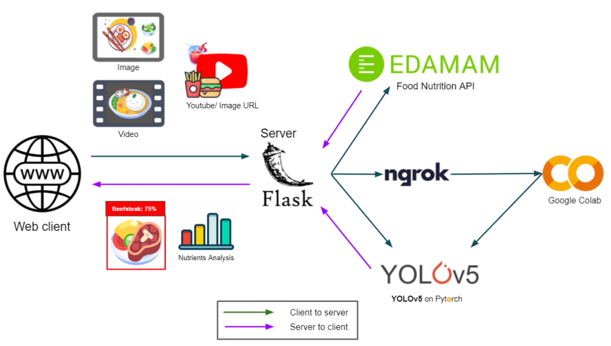
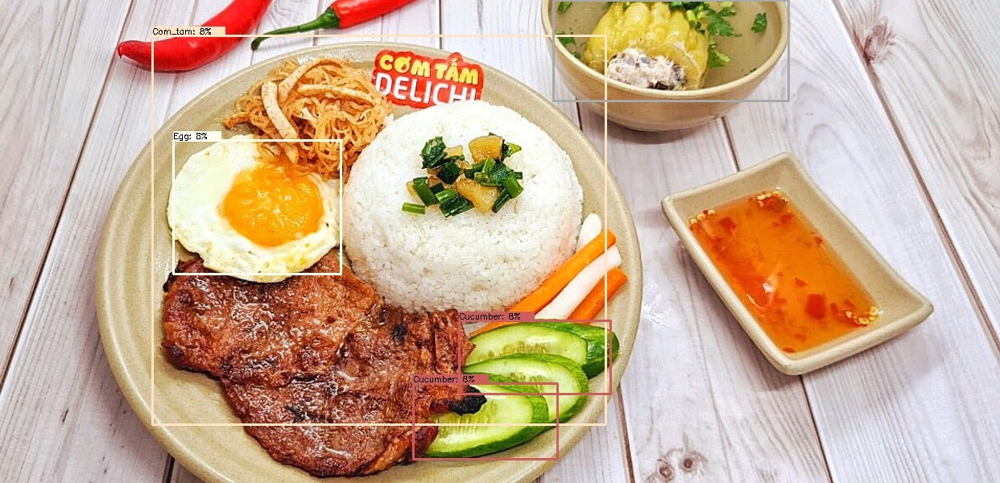
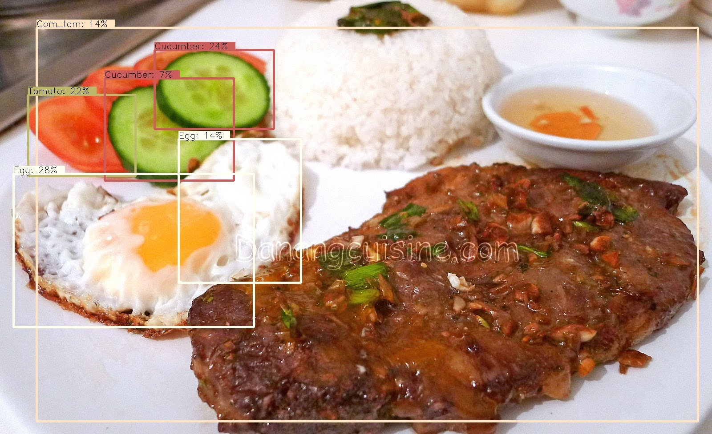
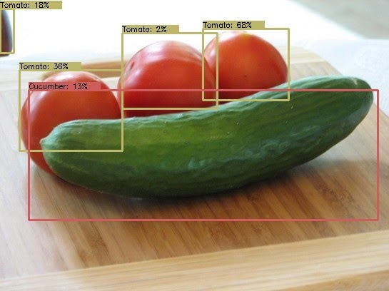
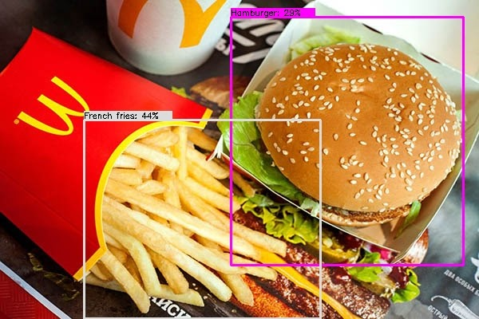
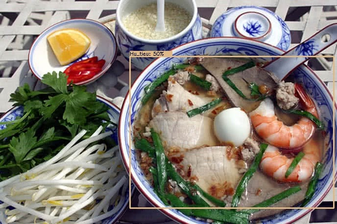

<h1 align="center">🍔🍟🍗 Meal analysis with Theseus 🍞🍖🍕</h1>

<p align="center">

<!--  
  -->
 <a></a>
  <br>
</p>


<p align="center">
    <a href="./LICENSE"></a>
  <a href="https://www.codefactor.io/repository/github/lannguyen0910/food-recognition/overview/master"></a>
  <a href="https://www.python.org/"></a> 
<!--    <a href="https://github.com/lannguyen0910/food-detection-yolov5/stargazers">
    
    </a>
 <a href="https://github.com/lannguyen0910/food-detection-yolov5/fork">
 
 </a>
 <a href="https://github.com/lannguyen0910/food-detection-yolov5/issues">

</a>
<a href="https://github.com/lannguyen0910/food-detection-yolov5/pulls">

</a> -->
</p>

<!--
## 🌳 **Folder Structure**

<details>
  <summary><strong>Details</strong></summary>

```
food-detection-yolov5
|
│   app.py                    # Flask server
|   modules.py                # inference stage, export result files, csv,...
|
└───api      
│   └─── ...
│   └─── api.py               # make request, update db
│   └─── secret.py            # get reponse 
|
└───model                     
│   └─── ...
│   └─── detect.py            # image detection
│   └─── video_detect.py      # video detection
|
└───static
│   └─── ...
│   └─── assets               # contain upload files, detection files
│   └─── css                  # custom css files, bootstrap
│   └─── js
|       └─── ...
│       └─── client.js        # custom js for templates
│       └─── chart.js         # nutrients analysys with charts
|
└───templates
│   └─── ...  
│   └─── index.html           # upload files' page
│   └─── url.html             # input URLs' page    
```
</details> -->
   

<details open> <summary><strong>Dev logs</strong></summary>
<strong><i>[01/05/2024]</i></strong>  Fix ngrok bug on Colab https://github.com/lannguyen0910/food-recognition/issues/32 (Migrate to pyngrok).<br>
<strong><i>[24/10/2023]</i></strong>  Clean and refactor repo. Integrate YOLOv8 to food detection.<br>
<strong><i>[07/03/2022]</i></strong>  Big refactor. Integrate object detection, image classification, semantic segmentation into one <b><i>Ship of Theseus</i></b>.<br>
<strong><i>[31/01/2022]</i></strong>  Update to new YOLOv5 latest versions P5-P6. Can load checkpoints from original repo.<br>
 <strong><i>[26/12/2021]</i></strong> Update app on Android. <br>
 <strong><i>[12/09/2021]</i></strong> Update all features to the web app. <br>
 <strong><i>[16/07/2021]</i></strong> All trained checkpoints on custom data have been lost. Now use pretrained models on COCO for inference. 
</details>


## 📔  **Notebook**
- For inference, use this notebook to run the web app [](https://colab.research.google.com/drive/1X06Y-HSPeHbEWtsXpyal8R1PliiVvpJq?usp=sharing)
- For training, refer to these notebooks for your own training:
  -  Detection: [](https://drive.google.com/file/d/1SywGfyfj3SVrE7VAAl3CshB9s3o8WRXL/view?usp=sharing)
  -  Classification: [](https://colab.research.google.com/drive/11VzRR8NmJyZGJ-3obkuV0zZAlYAPhCY1?usp=sharing)
  - Semantic segmentation: [](https://colab.research.google.com/drive/16xe6WL5mAAmpm-ab0xo1LONV3tAtI-4O?usp=sharing)
<!-- - For export, use this notebook and follow the instructions [](https://colab.research.google.com/drive/1nf0lLo6e2nMAt_AtDNoHmeXzdAB9kxsj?usp=sharing) -->


## 🥇 **Pretrained-weights**
- [Link](https://drive.google.com/drive/folders/15PlXWkFheuBxJOYkwm9iS_aZCcr8L0A7?usp=sharing)
- Detection: <a href="https://wandb.ai/lannguyen/food-detection-yolov5"></a>
 
| Models  | Image Size | Epochs | mAP@0.5 | mAP@0.5:0.95 |
| ------- | :--------: | :----: | :-----: | :----------: |
| YOLOv5s |  640x640   |  172   |  0.907  |    0.671     |
| YOLOv5m |  640x640   |  112   |  0.897  |    0.666     |
| YOLOv5l |  640x640   |  118   |  0.94   |     0.73     |
| YOLOv5x |  640x640   |   62   |  0.779  |    0.533     |
| YOLOv8s |  640x640   |   70   |  0.963  |     0.82     |

- Segmentation:
  
| Models | Image Size | Epochs | Pixel AP | Pixel AR | Dice score |
| ------ | :--------: | :----: | :------: | :------: | :--------: |
| UNet++ |  640x640   |   5    |  0.931   |  0.935   |   99.95    |

- Classification:
  
| Models          | Image Size | Epochs |  Acc   | Balanced Acc | F1-score |
| --------------- | :--------: | :----: | :----: | :----------: | :------: |
| EfficientNet-B4 |  640x640   |   7    | 84.069 |    86.033    |  84.116  |

## 🌟 **Logs detail**
In total, there are 3 implementation versions:
1. Training using our own object detection's template. The model's source code is inherited from the <a href="https://github.com/ultralytics/yolov5">Ultralytics</a> source code repo, the dataset is used in COCO format and the training and data processing steps are reinstalled by us using Pytorch. Ensemble technique, merge result of 4 models, only for images. Label enhancement technique, if the output label (after detection) is either "Food" or "Food-drinks", we use a pretrained Efficientnet-B4 classifier (on 255 classes) to re-classify it to another reasonable label.
2. Big refactor, update the training steps, used from <a href="https://github.com/ultralytics/yolov5">Ultralytics</a> source code repo too. The models yield better accuracy. Test-time augmentation technique is added to the web app.
3. Update **Theseus** template, currently supports ```food detection```, ```food classification```, ```multi-class food semantic segmentation``` only on **images**.  For this version, we introduce **Theseus**, which is just a part of [Theseus template](https://github.com/kaylode/theseus). Moreover, we omitted some weak or unnecessary features to make the project more robust. **Theseus** adapted from big project templates such as: [mmocr](https://github.com/open-mmlab/mmocr), [fairseq](https://github.com/pytorch/fairseq), [timm](https://github.com/rwightman/pytorch-image-models), [paddleocr](https://github.com/PaddlePaddle/PaddleOCR),... 
  
For those who want to play around with the first version, which remains some features, differ from the new version. You can check out the [v1](https://github.com/lannguyen0910/food-detection-yolov5/tree/v1) branch.

 ## 🌟 **Inference**
- Install requirements.
```
pip install -e .
```

<!-- - (Optional) Install [ffmpeg](http://ffmpeg.org/). Rebuild ```ffmpeg``` with ```OpenCV``` to display ```MP4``` video in browser: [link](https://stackoverflow.com/questions/31040746/cant-open-video-using-opencv). Or check out the inference notebook: [](https://drive.google.com/file/d/1CGEtC65kvoZ-4tcqzeknGrbERvb0beuU/view?usp=sharing)
```
sudo apt-get install ffmpeg
``` -->

- Start the app (Windows). Safe to run in insecure connection ```http``` on localhost. You can generate SSL certificate to run the app in ```https```.
```
run.bat
```
or 
```python
python3 app.py
```

<!-- - Switch between ```CPU``` and ```GPU``` in ```configs```
```python
global:
    device: cuda:0 #cpu
``` -->


## 🌟 **Dataset**
- Detection: [link](https://drive.google.com/drive/folders/14rJclN97hZqe6bmGkTjnvPaDBBIF4v5w?usp=sharing) (merged OID and Vietnamese Lunch dataset)
- Classification: [link](https://drive.google.com/drive/folders/11PH1ZF3ZCMKDQvxrblBA-Zy02iWgM4lq?usp=sharing) (MAFood121)
- Semantic segmentation: [link](https://mm.cs.uec.ac.jp/uecfoodpix/UECFOODPIXCOMPLETE.tar) (UECFood)

## 🌟 **Dataset details**
<details>
<summary>To train the food detection model, we survey the following datasets:</summary>
  
  - <a href="https://storage.googleapis.com/openimages/web/index.html">Open Images V6-Food</a>: Open Images V6 is a huge dataset from Google for Computer Vision tasks. To solve our problem, we extracted from a large dataset on food related labels. The extracted set includes 18 labels with more than 20,000 images.
  - <a href="http://foodcam.mobi/dataset.html">School Lunch Dataset</a>: includes 3940 photos of a lunch of Japanese high school students, taken at the same frontal angle with the goal of assessing student nutrition. Labels consist of coordinates and types of dishes are attached and divided into 21 different dishes, in the dataset there is also a label "Other Foods" if the dishes do not belong to the remaining 20 dishes.
  - <a href="https://drive.google.com/drive/folders/1PLrsJBS1EtJLY6RpEriASTfQ5WRlPQAt?usp=sharing">Vietnamese Food</a>: a self-collected dataset on Vietnamese dishes, including 10 simple dishes of our country such as: Pho, Com Tam, Hu Tieu, Banh Mi,... Each category has about 20-30 images, divided 80-20 for training and evaluation.
  
We aggregate all the above datasets to proceed training. Dishes that appear in different sets will be grouped into one to avoid duplication. After aggregating, a large data set of 60,305 images with 44 different foods from all regions of the world.
<br>
  
In addition, we find that if we expand the problem to include classification, the dataset will increase significantly. Therefore, to further enhance the diversity of dishes, we collect additional datasets to additionally train a classification model:
  - <a href="http://www.ub.edu/cvub/mafood121/">MAFood-121</a>: consisting of 21,175 training image samples. The dishes are selected from the top 11 most popular cuisines in the world according to Google Trends statistics, these cuisines come from many countries around the world, especially Vietnam. For each type of cuisine, 11 typical traditional dishes are selected. The dataset has a total of 121 different types of dishes, each belonging to at least 1 of 10 food categories: Bread, Eggs, Fried, Meat, Noodles, Rice, Seafood, Soup, Dumplings, and Vegetables . 85% of the images are used for training and the remaining 15% for evaluation.
  - <a href="https://data.vision.ee.ethz.ch/cvl/datasets_extra/food-101/">Food-101</a>: includes 101 different types of dishes, with 101,000 sets of photos. For each dish, 250 images were used as test images and the remaining 750 images were used for training. The training images in this set still have a lot of noise, sometimes the colors are too sharp or some of the data samples are mislabeled, these noises are intentional by the author (mentioned in the study).
  
We also perform the aggregation of the two data sets above into one. The new set includes <b>93,748 training images</b> and <b>26,825 evaluation images</b> with a total of <b>180 different dishes</b>. It can be seen that the number of dishes has increased significantly, if the model detects a dish labeled "Other Foods", the classification model will be applied to this dish and classified again.
</details>

## 🌟 **Server**
<details>
<summary>Implementation details</summary>
   
The function ```get_prediction``` is an inference function for ```detection```, ```classification``` and ```semantic segmentation``` tasks, depends on which inputs you choose. Implemented in ```modules.py```, where the image detection process will call the Edamam API to get nutritional information in the food. We also save nutritional information in csv files in the folder ```/static/csv```.
<br>

We provide the user with the ability to customize the threshold of confidence and iou so that the user can find a suitable threshold for the input image. In order not to have to rerun the whole model every time these parameters are changed, when the image is sent from the client, the server will perform a ```perceptual hash``` encryption algorithm to encrypt the image and using that resulting string to name the image when saving to the server. This helps when the client sends an image whose encoding already exists in the database, the server will only post-process the previously predicted result without having to re-execute the prediction.

</details>
   
## 🌟 **Additional Methods**
<details>
<summary>To increase the variety of dishes, we apply a classification model:</summary>
<br>
After testing and observing, we use a simple and effective model: EfficientNet. EfficientNet is proposed by Google and is one of the state-of-the-art models in this classification problem, and efficiency is also guaranteed. We apply the EfficientNet model source code from rwightman, we select the <b>EfficientNet-B4</b> version for retraining on the aggregated dataset. This model is used as an additional improvement to the YOLOv5 model in case the model detects a dish labeled as "Other Foods", only then EfficientNet is applied to predict the label again for this dish.
  
</details>
<details>
<summary>To increase the accuracy of the algorithm, we use the ensemble models technique:</summary>
<br>
  
For each image, models with different versions are used to predict, the results are then aggregated using the "<b>weighted box fusion</b>" method to give the final result.
  
</details>
<details>
<summary>To increase users' interactivity with the application:</summary>
<br>
  
When a dish is predicted, we provide more information about the nutritional level of that dish to the user. This information is queried from the application's database, which will be periodically updated from the Edamam API - an API that allows querying the nutrition of a dish by dish name. When doing prediction, the nutrition information will be saved along with the dish name under <b>CSV</b> format. We then fetch the CSV file on the client site to proceed drawing nutritrion statistics chart using <a href="https://github.com/chartjs/Chart.js">Chart.js</a> library. There are a total of 2 chart types, which appear when the user clicks on that chart type.
</details>

## 🍱 **Sample Results**
<p float="left">
   
  
  
  
   
  
</p>

## 📙 **Credits**

- Custom template: https://github.com/kaylode/theseus
- YOLOv5: https://github.com/ultralytics/yolov5
- YOLOv8: https://github.com/ultralytics/ultralytics
- Timm models: https://github.com/ultralytics/ultralytics
- Segmentation models: https://github.com/qubvel/segmentation_models.pytorch
- Edamam API: https://developer.edamam.com/food-database-api-docs
- Chart.js: https://github.com/chartjs/Chart.js
