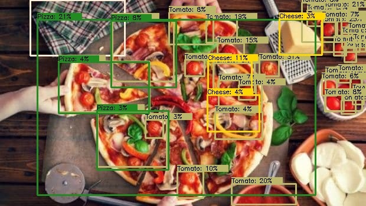
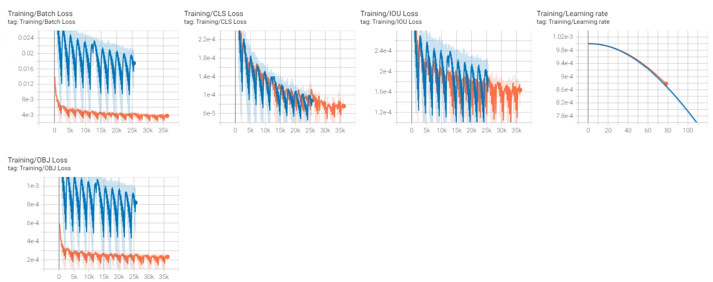
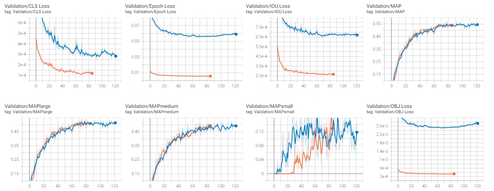
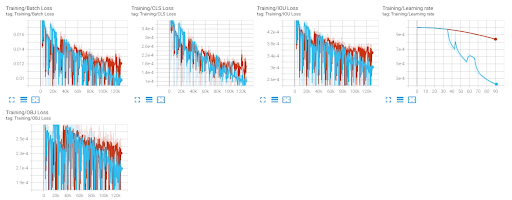
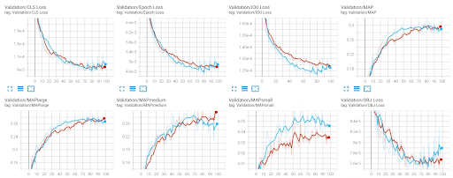

<h1 align="center">🍔🍟🍗 Food Analysis with YOLOv5 🍞🍖🍕</h1>

<p align="center">
   <a href="./LICENSE"></a>

 <a href="https://github.com/lannguyen0910/food-detection-yolov5/stargazers">
 
 </a>
 <a href="https://github.com/lannguyen0910/food-detection-yolov5/fork">
 
 </a>
 
 
 <a></a>
  <br>
</p>


<p align="center">
  <a href="https://www.codefactor.io/repository/github/lannguyen0910/food-detection-yolov5/overview/master"></a>
  <a href="https://www.python.org/"></a>
 
 <a href="https://github.com/lannguyen0910/food-detection-yolov5/issues">

</a>
<a href="https://github.com/lannguyen0910/food-detection-yolov5/pulls">

</a>
</p>

## 🌳 **Folder Structure**

<details>
  <summary><strong>Details</strong></summary>

```
food-detection-yolov5
|
│   app.py                    # Flask server
|   modules.py                # inference stage, export result files, csv,...
|
└───api      
│   └─── ...
│   └─── api.py               # make request, update db
│   └─── secret.py            # get reponse 
|
└───model                     
│   └─── ...
│   └─── detect.py            # image detection
│   └─── video_detect.py      # video detection
|
└───static
│   └─── ...
│   └─── assets               # contain upload files, detection files
│   └─── css                  # custom css files, bootstrap
│   └─── js
|       └─── ...
│       └─── client.js        # custom js for templates
│       └─── chart.js         # nutrients analysys with charts
|
└───templates
│   └─── ...  
│   └─── index.html           # upload files' page
│   └─── url.html             # input URLs' page    
```
</details>

## 🌟 **Run on local machine (require CUDA)**
- Clone the repo.
```
git clone https://github.com/lannguyen0910/food-detection-yolov5
cd food-detection-yolov5/
```
- Install dependencies.
```
pip install -r requirements.txt
pip install opencv-python --upgrade
```

- (Optional) Install [ffmpeg](http://ffmpeg.org/). Rebuild ```ffmpeg``` with ```OpenCV``` to display MP4 video in browser: [link](https://stackoverflow.com/questions/31040746/cant-open-video-using-opencv). Or check out the colab notebook bellow: [](https://colab.research.google.com/drive/1JMH9vwvxmWy72yXxV2-niRUTW_J3PlQM?usp=sharing)
```
sudo apt-get install ffmpeg
```

- Start the app. Safe to run in insecure connection ```http``` on localhost. You can generate SSL certificate to run the app in ```https```.
```
python app.py --host=localhost:3000
```

Or run this command in your terminal to clear cache files after running.
```
run.bat
```

🚨 **UPDATE**:
- We lost our pretrained weights and datasets so we have to collect new datasets and train again.
- Best current [weights](https://drive.google.com/drive/folders/1gL16SVnLeI7cUnBMeK54JwKKOWiOybrc?usp=sharing). The accuracy is still very low on our custom datasets, will update the weights gradually.
- Visualize [test images](https://drive.google.com/drive/folders/1Af7Ilg99fI8p3T7BM5cFo5lJz_xY-Jxt?usp=sharing) with best current weights.


## 🌟 **Run on Google Colab**
- Open notebook and follow the instructions [](https://colab.research.google.com/drive/1JMH9vwvxmWy72yXxV2-niRUTW_J3PlQM?usp=sharing)
<!-- - (https://colab.research.google.com/drive/1SFDqNEQA9hrVA6zFn7wb0il-wV2Unou8?usp=sharing)-->

## 🌟 **Train YOLOv5 using our object detection's template** 
- Update new datasets: [detection-dataset](https://drive.google.com/drive/folders/1qivPtnHk6OpvsTyRUGOF1c2a86CMwBY1?usp=sharing) & [classification-dataset](https://drive.google.com/drive/folders/11PH1ZF3ZCMKDQvxrblBA-Zy02iWgM4lq?usp=sharing)
- You can try merging all the train/val annatation.json files of all the datasets using this [module](https://github.com/lannguyen0910/food-detection-yolov5/blob/master/model/datasets/merge.py)
- Remember when we train YOLOv5 in COCO format, not in YOLO format because the template supports for EfficientDet too: [detection-template](https://github.com/kaylode/custom-template/tree/detection) & [classification-template](https://github.com/kaylode/custom-template/tree/classification)
- Open notebook and follow the instructions [](https://drive.google.com/file/d/1gl_Y6nVKyfAhAgqxJdIIBeb02gu1BNYQ/view?usp=sharing)

## 🌟 **Food app on android**
- Visit [food-android](https://github.com/lannguyen0910/food-detection-yolov5/tree/food-android) branch.
- Modified code from [original repo](https://github.com/cmdbug/YOLOv5_NCNN).
- First [apk](https://github.com/lannguyen0910/food-detection-yolov5/releases/tag/1.0) release.
- Because we have not trained enough so the accuracy of the model is still low. We'll update gradually.
- The app is for learning purpose only!


## 🌟 **Export Torchscript / Onnx / Bin-Param for [ncnn](https://github.com/Tencent/ncnn) usage**
- Example usage:
```
pip install onnx>=1.9.0 onnx-simplifier>=0.3.6
python export.py --weights yolov5s_best.pth --imgsz 640 --include onnx
```
Or
```
python export.py --weights yolov5s_best.pth --imgsz 320 320 --include torchscript
```

- Open notebook and follow the instructions [](https://colab.research.google.com/drive/1nf0lLo6e2nMAt_AtDNoHmeXzdAB9kxsj?usp=sharing)

## 🌟 **Datasets**
<details>
<summary>To train the food detection model, we survey the following datasets:</summary>
  
  - <a href="https://storage.googleapis.com/openimages/web/index.html">Open Images V6-Food</a>: Open Images V6 is a huge dataset from Google for Computer Vision tasks. To solve our problem, we extracted from a large dataset on food related labels. The extracted set includes 18 labels with more than 20,000 images.
  - <a href="http://foodcam.mobi/dataset.html">School Lunch Dataset</a>: includes 3940 photos of a lunch of Japanese high school students, taken at the same frontal angle with the goal of assessing student nutrition. Labels consist of coordinates and types of dishes are attached and divided into 21 different dishes, in the dataset there is also a label "Other Foods" if the dishes do not belong to the remaining 20 dishes.
  - <a href="https://drive.google.com/drive/folders/1PLrsJBS1EtJLY6RpEriASTfQ5WRlPQAt?usp=sharing">Vietnamese Food</a>: a self-collected dataset on Vietnamese dishes, including 10 simple dishes of our country such as: Pho, Com Tam, Hu Tieu, Banh Mi,... Each category has about 20-30 images, divided 80-20 for training and evaluation.
  
We aggregate all the above datasets to proceed training. Dishes that appear in different sets will be grouped into one to avoid duplication. After aggregating, a large data set of 60,305 images with 44 different foods from all regions of the world.
<br>
  
In addition, we find that if we expand the problem to include classification, the dataset will increase significantly. Therefore, to further enhance the diversity of dishes, we collect additional datasets to additionally train a classification model:
  - <a href="http://www.ub.edu/cvub/mafood121/">MAFood-121</a>: consisting of 21,175 training image samples. The dishes are selected from the top 11 most popular cuisines in the world according to Google Trends statistics, these cuisines come from many countries around the world, especially Vietnam. For each type of cuisine, 11 typical traditional dishes are selected. The dataset has a total of 121 different types of dishes, each belonging to at least 1 of 10 food categories: Bread, Eggs, Fried, Meat, Noodles, Rice, Seafood, Soup, Dumplings, and Vegetables . 85% of the images are used for training and the remaining 15% for evaluation.
  - <a href="https://data.vision.ee.ethz.ch/cvl/datasets_extra/food-101/">Food-101</a>: includes 101 different types of dishes, with 101,000 sets of photos. For each dish, 250 images were used as test images and the remaining 750 images were used for training. The training images in this set still have a lot of noise, sometimes the colors are too sharp or some of the data samples are mislabeled, these noises are intentional by the author (mentioned in the study).
  
We also perform the aggregation of the two data sets above into one. The new set includes <b>93,748 training images</b> and <b>26,825 evaluation images</b> with a total of <b>180 different dishes</b>. It can be seen that the number of dishes has increased significantly, if the model detects a dish labeled "Other Foods", the classification model will be applied to this dish and classified again.
</details>

## 🌟 **YOLOv5 models**
We use <b>4 YOLOv5 versions (s, m, l and x)</b> and their pre-trained weights to train on our problem. The model's source code is inherited from the <a href="https://github.com/ultralytics/yolov5">Ultralytics</a> source code repo, and the training and data processing steps are reinstalled by us using Pytorch. When training, data augmentation methods are applied to minimize the model's easy overfit.
<br>

## 🌟 **Server**
<details>
<summary>Implementation details</summary>
   
The two functions: ```get_prediction``` and ```get_video_prediction``` are two inference functions for images and videos. Implemented in ```modules.py```, where the image detection process (get_prediction) will call the Edamam API to get nutritional information in the food. We also save nutritional information in csv files in the folder ```/static/csv```.
<br>

We provide the user with the ability to customize the threshold of confidence and iou so that the user can find a suitable threshold for the input image. In order not to have to rerun the whole model every time these parameters are changed, when the image is sent from the client, the server will perform a ```perceptual hash``` encryption algorithm to encrypt the image and using that resulting string to name the image when saving to the server. This helps when the client sends an image whose encoding already exists in the database, the server will only post-process the previously predicted result without having to re-execute the prediction.
<br>

In addition, the team also saved the models as ```global variables```. When starting Flask Server, the model will be initialized only once. Only when there is a change in model selection, this variable will be reinitialized, otherwise the model will not be reinitialized when there are new image queries, this will somewhat reduce the processing time.
</details>
   
## 🌟 **Additional Methods**
<details>
<summary>To increase the variety of dishes, we apply a classification model:</summary>
<br>
After testing and observing, we use a simple and effective model: EfficientNet. EfficientNet is proposed by Google and is one of the state-of-the-art models in this classification problem, and efficiency is also guaranteed. We apply the EfficientNet model source code from rwightman, we select the <b>EfficientNet-B4</b> version for retraining on the aggregated dataset. This model is used as an additional improvement to the YOLOv5 model in case the model detects a dish labeled as "Other Foods", only then EfficientNet is applied to predict the label again for this dish.
  
</details>
<details>
<summary>To increase the accuracy of the algorithm, we use the ensemble models technique:</summary>
<br>
  
For each image, models with different versions are used to predict, the results are then aggregated using the "<b>weighted box fusion</b>" method to give the final result.
  
</details>
<details>
<summary>To increase users' interactivity with the application:</summary>
<br>
  
When a dish is predicted, we provide more information about the nutritional level of that dish to the user. This information is queried from the application's database, which will be periodically updated from the Edamam API - an API that allows querying the nutrition of a dish by dish name. When doing prediction, the nutrition information will be saved along with the dish name under <b>CSV</b> format. We then fetch the CSV file on the client site to proceed drawing nutritrion statistics chart using <a href="https://github.com/chartjs/Chart.js">Chart.js</a> library. There are a total of 2 chart types, which appear when the user clicks on that chart type.
</details>

## 🍱 **Sample Results**
<p float="left">
   
  
  
  
   
  
</p>

## 📝 **Appendix**
<details open>
<summary>mAP of each model:</summary>
  <br>
  
Due to hardware limitations, only two models YOLOv5s and YOLOv5m were trained on the entire dataset, the other two models, YOLOv5l and YOLOv5x, were trained on only a small set of data.
  <br>
  
- Valset:

| Models  | Image Size | mAPsmall | mAPmedium | mAPlarge | mAP@0.5:0.95 |
| ------- | :--------: | :------: | :-------: | :------: | :----------: |
| YOLOv5s |  640x640   |    5     |   29.7    |   31.1   |     31.5     |
| YOLOv5m |  640x640   |   8.6    |   30.1    |   30.9   |     32.3     |
| YOLOv5l |  640x640   |   16.7   |   51.9    |   52.0   |     56.0     |
| YOLOv5x |  640x640   |   18.4   |    50     |   50.9   |     55.1     |

---

- Testset:

| Models  | Image Size | mAPsmall | mAPmedium | mAPlarge | mAP@0.5:0.95 |
| ------- | :--------: | :------: | :-------: | :------: | :----------: |
| YOLOv5s |  640x640   |   6.3    |   28.4    |   30.3   |     30.5     |
| YOLOv5m |  640x640   |   7.5    |   28.7    |   30.6   |     30.9     |
| YOLOv5l |  640x640   |   38.4   |   46.8    |   57.9   |     57.5     |
| YOLOv5x |  640x640   |   55.0   |   48.9    |   59.8   |     55.1     |
</details>
<br>

<details>
  <summary>The loss and the learning rate through the loops of the 2 models YOLOv5l and YOLOv5x , have different values due to different image sizes:</summary>
  <br>
  
   
</details>

<details>
  <summary>Losses and mAP of 2 models YOLOv5l and YOLOv5x:</summary>
  <br>
  
   
  <br>
  
The results on valset are quite similar between the two models, the highest mAPsmall value belongs to YOLOv5x, because it was trained on a larger image. However, due to the limitation of Google Colab, and the number of parameters of these two models is quite high, the training has not been completed, the model has not really converged. We found that if the training was longer, there would be better results.
  
</details>

<details>
  <summary>The YOLOv5s and YOLOv5m models were trained on the entire large dataset and converged after 100 epochs, both trained with the same configuration. The result of the training process of YOLOv5s and YOLOv5m models are as follows:</summary>
  <br>
  

  
  
  <br>
  
It was observed that the YOLOv5m model converged faster than the YOLOv5s, and also overfitted the data more quickly. The highest mAPmedium and mAPlarge values of the two models are also quite close, however YOLOv5m outperforms the other model in detecting small objects.

</details>
<br>

We conclude that the learned models are quite good compared to such huge data with such a variety of dishes, and their complexity is also guaranteed to be suitable for practical applications. We show that the system is scalable and has high practical significance for the people of Vietnam in particular and the world in general.
<br>

## 💡 **Further Improvements**
- We have yet to solve the problem of messy data labels (with one sample labeling the dish, another labeling the ingredients of the dish) causing the score to be not really accurate. You can try to train on other food datasets for better experience!

- Feel free to make a contribution to the project by pulling a request or making an issue.

## 📙 **Credits**
- YOLOv5 official repo: https://github.com/ultralytics/yolov5.
- Object detection's custom template: https://github.com/kaylode/custom-template/tree/detection.
- Base code for android app: https://github.com/cmdbug/YOLOv5_NCNN.
- Ncnn by Tencent: https://github.com/Tencent/ncnn
- Edamam API: https://developer.edamam.com/food-database-api-docs.
- Chart.js: https://github.com/chartjs/Chart.js.
